# Winload 

> 輕量級實時終端網路流量監控工具，靈感來自 Linux 的 nload。

> **[📖 English](readme.md)**
> **[📖 简体中文(大陆)](readme.zh-cn.md)**
> **[📖 繁體中文(台灣)](readme.zh-tw.md)**
> **[📖 日本語](readme.jp.md)**
> **[📖 한국어](readme.ko.md)**

[](https://github.com/VincentZyuApps/winload)
[](https://gitee.com/vincent-zyu/winload)

[](https://github.com/VincentZyuApps/winload/releases)
[](https://github.com/VincentZyuApps/winload/releases)
[](https://github.com/VincentZyuApps/winload/releases)
[](https://github.com/VincentZyuApps/winload/releases)

[](https://pypi.org/project/winload/)
[](https://www.npmjs.com/package/@vincentzyuapps/winload)
[](https://crates.io/crates/winload)

[](https://scoop.sh/#/apps?q=%22https%3A%2F%2Fgithub.com%2FVincentZyuApps%2Fscoop-bucket%22&o=false)
[](https://aur.archlinux.org/packages/winload-rust-bin)
[](https://github.com/VincentZyuApps/winload/releases)
[](https://github.com/VincentZyuApps/winload/releases)

> **[📖 建置文檔](.github/workflows/build.zh-tw.md)**

## 🚀 簡介
`Winload` 是一個直觀的終端網路流量監控工具。最初為 Windows 打造，彌補 `nload` 在 Windows 上的空白，現已支援 Linux 和 macOS。

## 🙏 致謝
Winload 的靈感來自 Roland Riegel 的經典 「[nload](https://github.com/rolandriegel/nload)」 項目，感謝原作者的創意與體驗。
https://github.com/rolandriegel/nload

## ✨ 主要特性
- **雙實現版本**
	- **Rust 版**: 快速、內存安全、單靜態二進製文件，適合日常監控。
	- **Python 版**: 易於修改和擴展，適合原型開發或集成。
- **跨平台**: Windows、Linux、macOS（x64 & ARM64）。
- **實時可視化**: 實時上行/下行流量圖和吞吐量統計。
- **簡潔界面**: 乾淨的 TUI，沿襲 nload 的人體工程學設計。

## 📊 效能基準測試
> ⚡ Winload (Rust) 實現 **~10ms 啟動速度** 和 **<5MB 二進位檔案體積**，在效率上顯著優於 Python 並與 C++ nload 相當。



## 🐍 Python 版本安裝
> 💡 **實作說明**：僅 PyPI 和 GitHub/Gitee 源代碼是 Python 版本。  
> 僅 Cargo 提供 Rust 原始碼供本地編譯。  
> 所有其他套件管理器（Scoop、AUR、npm、APT、RPM）及 GitHub Releases 均提供 **Rust 二進制文件**。
### Python (pip)
```bash
pip install winload
# 推薦使用 uv：
# https://docs.astral.sh/uv/getting-started/installation/
# https://gitee.com/wangnov/uv-custom/releases
uv venv
uv pip install winload
uv run winload
uv run python -c "import shutil; print(shutil.which('winload'))"
```

## 📥 Rust 版本安裝（推薦）
### npm (跨平台)
```bash
npm install -g @vincentzyuapps/winload
npm list -g @vincentzyuapps/winload
# 在 Windows 上使用 win-nload 以避免與 System32\winload.exe 衝突
# 在 Linux/macOS 上，winload 和 win-nload 均可使用
# 或直接使用 npx
npx @vincentzyuapps/winload
```
> ⚠️ 舊包名 `winload-rust-bin` 已棄用，請使用 `@vincentzyuapps/winload`。改用 scoped 套件名稱是為了相容 [GitHub Packages](https://github.com/features/packages) 規範。

> 包含 6 個預編譯二進制文件：x86_64 & ARM64 版本，支援 Windows、Linux 和 macOS。

### Cargo (原始碼編譯)
```bash
cargo install winload
cargo install --list
```
### Windows (Scoop)
```powershell
scoop bucket add vincentzyu https://github.com/VincentZyuApps/scoop-bucket
scoop install winload
# 執行二進位檔案
win-nload
Get-Command win-nload # Powershell
where win-nload # CMD
```
> 💡 建議使用 [Windows Terminal](https://github.com/microsoft/terminal) 而非舊版 Windows Console，以獲得正確的中文字元渲染和更好的 TUI 體驗。
> ```powershell
> scoop bucket add versions
> scoop install windows-terminal-preview
> wtp
> ```

### Arch Linux (AUR):
```bash
paru -S winload-rust-bin
which winload
```

### Linux (一鍵安裝指令稿)
> 支援 Debian/Ubuntu 及其衍生版 —— Linux Mint、Pop!_OS、Deepin、UnionTech OS 等 (apt)

> 支援 Fedora/RHEL 及其衍生版 —— Rocky Linux、AlmaLinux、CentOS Stream 等 (dnf)
```bash
curl -fsSL https://raw.githubusercontent.com/VincentZyuApps/winload/main/docs/install_scripts/install.sh | bash
which winload
```
> 📄 [查看安裝指令稿原始碼](https://github.com/VincentZyuApps/winload/blob/main/docs/install_scripts/install.sh)

**🇨🇳 Gitee 鏡像（大陸地區下載更快）：**
```bash
curl -fsSL https://gitee.com/vincent-zyu/winload/raw/main/docs/install_scripts/install_gitee.sh | bash
which winload
```
> 📄 [查看 Gitee 安裝指令稿原始碼](https://gitee.com/vincent-zyu/winload/blob/main/docs/install_scripts/install_gitee.sh)

> ⚠️ 以上安裝指令稿僅適用於使用 **apt 或 dnf** 套件管理器的 **x86_64 / aarch64** 架構系統。其他平台請使用 **npm**（`npm install -g @vincentzyuapps/winload`）或 **Cargo**（`cargo install winload`）安裝。

<details>
<summary>手動安裝</summary>

**DEB (Debian/Ubuntu):**
```bash
# 從 GitHub Releases 下載最新 .deb 包
sudo dpkg -i ./winload_*_amd64.deb
# 或使用 apt（自動處理依賴）
sudo apt install ./winload_*_amd64.deb
which winload
```

**RPM (Fedora/RHEL):**
```bash
sudo dnf install ./winload-*-1.x86_64.rpm
which winload
```

**或者直接從 [GitHub Releases](https://github.com/VincentZyuApps/winload/releases) 下載二進制文件。**

</details>

## ⌨️ 用法

```bash
winload              # 監控所有活躍網路藉口
winload -t 200       # 設定刷新間隔為 200ms
winload -d "Wi-Fi"   # 啟動時定位到 Wi-Fi 網卡
winload -e           # 啟用 emoji 裝飾 🎉
winload --npcap      # 擷取 127.0.0.1 回環流量 (Windows，需安裝 Npcap)
```

### 參數選項

| 參數 | 說明 | 預設值 |
|------|------|--------|
| `-t`, `--interval <MS>` | 刷新間隔（毫秒） | `500` |
| `-a`, `--average <SEC>` | 平均值計算視窗（秒） | `300` |
| `-d`, `--device <NAME>` | 預設裝置名稱（模糊比對） | — |
| `-e`, `--emoji` | 啟用 emoji 裝飾 🎉 | 關閉 |
| `-U`, `--unicode` | 使用 Unicode 方塊字元繪圖（█▓░·） | 關閉 |
| `-u`, `--unit <UNIT>` | 顯示單位：`bit` 或 `byte` | `bit` |
| `-b`, `--bar-style <STYLE>` | 狀態列樣式：`fill`、`color` 或 `plain` | `fill` |
| `--in-color <HEX>` | 下行圖形顏色，十六進位 RGB（如 `0x00d7ff`） | 青色 |
| `--out-color <HEX>` | 上行圖形顏色，十六進位 RGB（如 `0xffaf00`） | 金色 |
| `-m`, `--max <VALUE>` | 固定 Y 軸最大值（如 `10M`、`1G`、`500K`） | 自動 |
| `-n`, `--no-graph` | 隱藏圖形，僅顯示統計資訊 | 關閉 |
| `--hide-separator` | 隱藏分隔線（等號一行） | 關閉 |
| `--no-color` | 停用所有 TUI 顏色（單色模式） | 關閉 |
| `--smart-max [SECS]` | **[Rust Only]** 智慧自適應 Y 軸上限：流量尖峰後自動指數回落，波形更生動（半衰期，秒，預設 5s） | 關閉 |
| `--npcap` | **[Windows Rust Only]** 透過 Npcap 擷取回環流量（建議） | 關閉 |
| `--debug-info` | **[Rust Only]** 列印網路介面除錯資訊後退出 | — |
| `-h`, `--help` | 列印說明（`--help --emoji` 可查看 emoji 版！） | — |
| `-V`, `--version` | **[Rust Only]** 列印版本號 | — |

### 快捷鍵

| 按鍵 | 功能 |
|------|------|
| `←` / `→` 或 `↑` / `↓` | 切換網路裝置 |
| `=` | 切換分割線的顯示/隱藏 |
| `c` | 切換顏色開/關 |
| `q` / `Esc` | 退出 |

## 🪟 Windows 回環流量 (127.0.0.1)

Windows 無法透過標準 API 回報回環流量——這是 [Windows 網路堆疊的功能缺失](docs/win_loopback.zh-tw.md)。

**要在 Windows 上擷取回環流量**，使用 `--npcap` 參數：

```bash
winload --npcap
```

需要安裝 [Npcap](https://npcap.com/#download)，安裝時勾選 "Support loopback traffic capture"。

> 我之前嘗試過直接輪詢 Windows 自帶的 `GetIfEntry` API，但 loopback 的計數器始終為 0——loopback 虛擬介面背後根本沒有 NDIS 驅動程式在計數。該程式碼路徑已被移除。

> 📖 深入了解 Windows 回環為何失效，請閱讀 [docs/win_loopback.zh-tw.md](docs/win_loopback.zh-tw.md)

在 Linux 和 macOS 上，回環流量開箱即用，無需額外參數。

## 🖼️ 預覽
#### Python 版預覽


#### Rust 版預覽
